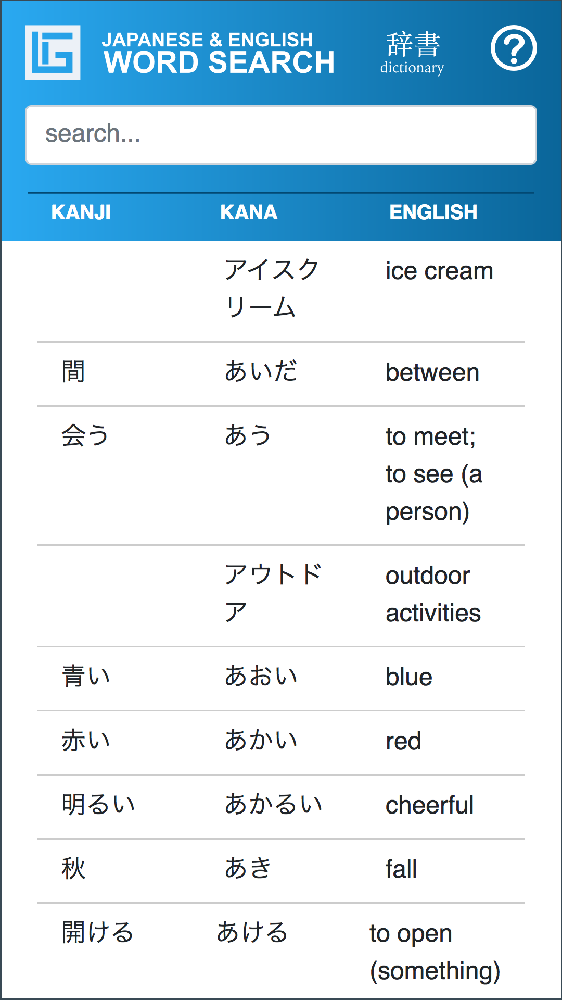
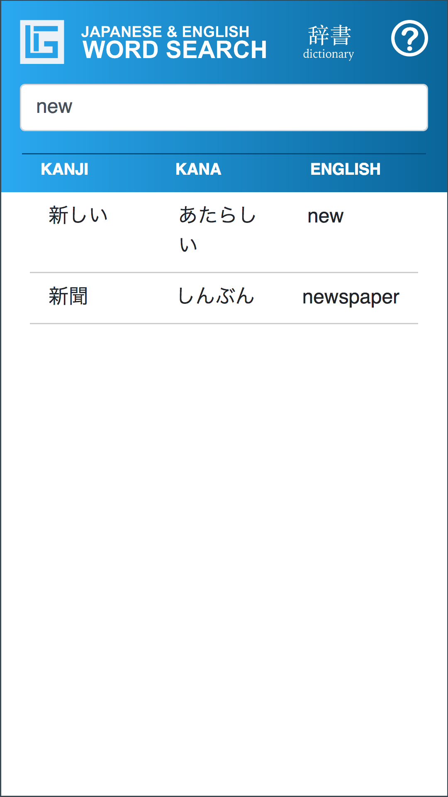
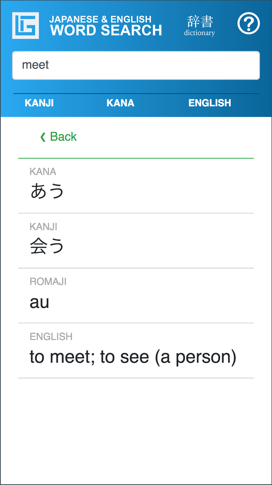
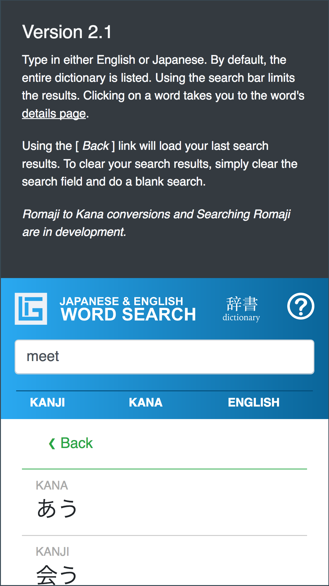
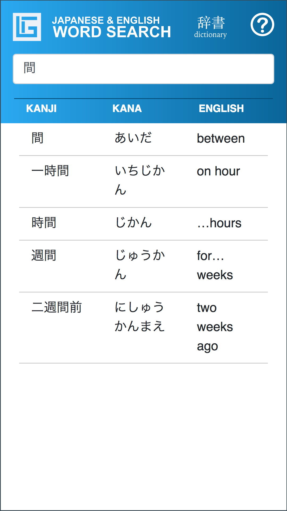

# Japanese & Engish Word Search Dictionary

A Japanese and English dictionary containing only the words from the book series "Genki an Integrated Course in Elementary Japanese". 

[Web Edition](https://linuxsandbox.coleman.edu/~ad660252086/learngenki/search/)

#### Version 2.1 - Completed

- Updated the look and colors
- Using Vanilla JS with Bootstrap 4 Framework
- Responsive
- Self-contained
- JSON
- Android update in production!!!
- Search both English and Japanese

##### Coming Soon
- Romaji to Kana Converter
- Search by Romaji

### Mobile Preview
_Clicking the (?) question shows the changes in the app_

    

