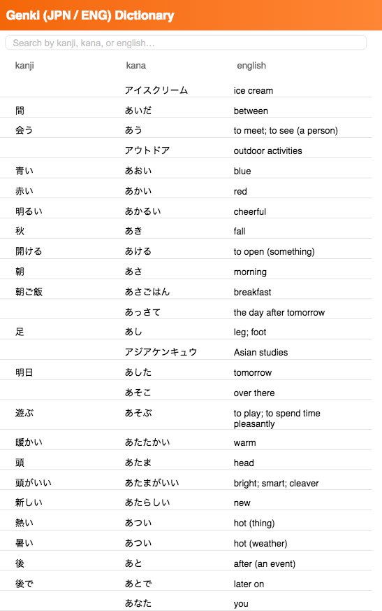

# Genki Japanese English Dictionary

A simple Japanese/English dictionary word search application. Currently developed using vanilla JS for prototype testing. 

It currently works. The focus is to convert this to React and React Native.

### JavaScript Code is easy to read with comments

- The code uses an EventListener and searches a JavaScript Object.
- There are currently 975 Japanese Words in databank.

### Current Working Version

[Live Edition](https://linuxsandbox.coleman.edu/~ad660252086/learngenki/search/)

